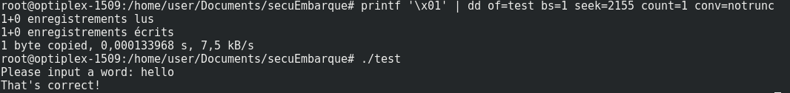

# TD emily : Reverse engineering

## Analyse statique

On cherche à determiner le type de fichier avec la commande *file* :

output :

```
ELF 64-bit LSB shared object, x86-64, version 1 (SYSV), dynamically linked, interpreter /lib64/ld-linux-x86-64.so.2, for GNU/Linux 2.6.32, BuildID[sha1]=23f76048299c064a36379025294b4a506e8d422d, not stripped
```

On constate qu'il s'agit bien d'un executable linux.

*strings* nous permet d'afficher les caractère affichables d'un fichier. En analysant la sortie, on trouve notamment les chaines de caractères suivantes :

```
poop
Please input a word:
That's correct!
That's not correct!
```

On a donc ici une indication sur ce que fait le programme.

L'utilitaire *objdump* va quant à lui nous permettre de desassembler le code, c'est à dire le traduire en language assembler à partir du binaire. Dans la sortie, on peut voir le code assembleur de la fonction is_valid :

```
0000000000000840 <is_valid>:
 840:	55                   	push   %rbp
 841:	48 89 e5             	mov    %rsp,%rbp
 844:	48 83 ec 10          	sub    $0x10,%rsp
 848:	48 89 7d f8          	mov    %rdi,-0x8(%rbp)
 84c:	48 8b 45 f8          	mov    -0x8(%rbp),%rax
 850:	48 8d 35 2d 01 00 00 	lea    0x12d(%rip),%rsi        # 984 <_IO_stdin_used+0x4>
 857:	48 89 c7             	mov    %rax,%rdi
 85a:	e8 71 fe ff ff       	callq  6d0 <strcmp@plt>
 85f:	85 c0                	test   %eax,%eax
 861:	75 07                	jne    86a <is_valid+0x2a>
 863:	b8 01 00 00 00       	mov    $0x1,%eax
 868:	eb 05                	jmp    86f <is_valid+0x2f>
 86a:	b8 00 00 00 00       	mov    $0x0,%eax
 86f:	c9                   	leaveq
 870:	c3                   	retq
```
on comprend que is_valid appelle la fonction strcmp au vu du chargement des paramètres mais aussi surtout des valeurs de retours (0 et 1).

du coté du main, on retrouve aussi l'appel à la fonction is_valid ainsi qu'une condition sur sa valeur de retour :

```
8b8:	48 8b 45 f8          	mov    -0x8(%rbp),%rax
8bc:	48 89 c7             	mov    %rax,%rdi
8bf:	e8 7c ff ff ff       	callq  840 <is_valid>
8c4:	85 c0                	test   %eax,%eax
8c6:	74 0e                	je     8d6 <main+0x65>
8c8:	48 8d 3d d3 00 00 00 	lea    0xd3(%rip),%rdi        # 9a2 <_IO_stdin_used+0x22>
8cf:	e8 dc fd ff ff       	callq  6b0 <puts@plt>
8d4:	eb 0c                	jmp    8e2 <main+0x71>
8d6:	48 8d 3d d5 00 00 00 	lea    0xd5(%rip),%rdi        # 9b2 <_IO_stdin_used+0x32>
8dd:	e8 ce fd ff ff       	callq  6b0 <puts@plt>
```

L'objectif fixé est de toujours faire renvoyer 1 (vrai) à la fonction is_valid, compromettant donc le bon fonctionnement du programme.

```
863:	b8 01 00 00 00       	mov    $0x1,%eax
86a:	b8 00 00 00 00       	mov    $0x0,%eax
```
En regardant les deux lignes suivantes, on comprend qu'il faudrait modifier le 2ème byte situé à la position 0x000000000000086a (bytes n°2154) soit le *byte n°2155*.

On peut le retrouver à l'aide de la commande *hexdump* :

```
00000860  c0 75 07 b8 01 00 00 00  eb 05 b8 00 00 00 00 c9  |.u..............|
```

On le modifie à l'aide de la commande suivante :

```
printf '\x01' | dd of=program bs=1 seek=2155 count=1 conv=notrunc
```


# Binwalk
