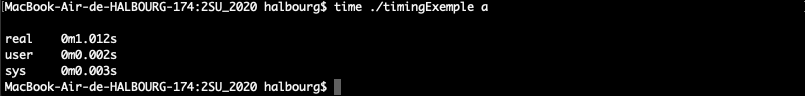
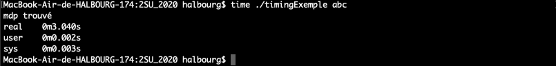

- Quels sont les chemins d'attaque possibles sur la signature d'un système embarqué?

Il est possible de dumper la mémoire du hardware pour récupérer les clés, d'effectuer ou attaque bit-flip, de faire du reverse engineering sur le système mais aussi de casser directement les clés.

- A quoi sert la chaîne de confiance? Pourquoi est-elle nécessaire?

La chaîne de confiance permet d'assurer la sécurité d'un système au niveau de plusieurs couches, du hardware au software. Ainsi, si un attaquant découvre une faille au niveau d'une couche supérieure, d'autres éléments de sécurité seront en place pour l'empêcher de descendre à une couche inférieure. Ce concept est lié à la défense en profondeur.


- Décrire la méthode pour aborder la sécurité sur un produit embarqué. Pourquoi établir un modèle d'attaquant est-il important?

Dans un premier temps, il faut déterminer ce que fait notre produit. Ensuite, il faut essayer de deviner ce que l'attaquant peut gagner en visant celui-ci. Il faut également identifier par où on rentre dans le système pour ensuite comprendre où l'adversaire peut faire mal. Enfin, il convient d'ajouter la sécurité adéquate.

- Trouver un moyen rapide de faire du debug embarqué (par exemple sur cible ARM)? Expliquer les avantages

La solution la plus rapide reste d'utiliser le port JTAG intégré au microcontrolleur. Cela necessite souvent une interface entre le PC et le port JTAG.

- Lister les catégories de bug possibles et comment les exploiter et les défendre

Les exploitations de bugs correspondent à des **attaques sofwares**.

**stack buffer overflow** : déclaration d'un tableau statique et tentative d'accès à une case non définie

*Solution* : vérifier les bornes

**heap buffer overflow** : déclaration d'un tableau dynamique trop grand (gros malloc) ou utilisation d'un pointeur après un free.

*Solution* : mettre le free après

**signedness error** : si un entier int n'est pas uint, il sera convertit en un nombre positif, ce qui amène à des comportements inattendus.

**use ininitialized** : si une variable n'est pas initialisée dans un programme, elle peut etre changée par un autre programme.

**format string** : certains pourcentages donnent un accès à la RAM.

*Solution* : sanitize inputs


# TD emily : Reverse engineering

## Analyse statique

On cherche à determiner le type de fichier avec la commande *file* :

output :

```
ELF 64-bit LSB shared object, x86-64, version 1 (SYSV), dynamically linked, interpreter /lib64/ld-linux-x86-64.so.2, for GNU/Linux 2.6.32, BuildID[sha1]=23f76048299c064a36379025294b4a506e8d422d, not stripped
```

On constate qu'il s'agit bien d'un executable linux.

*strings* nous permet d'afficher les caractère affichables d'un fichier. En analysant la sortie, on trouve notamment les chaines de caractères suivantes :

```
poop
Please input a word:
That's correct!
That's not correct!
```

On a donc ici une indication sur ce que fait le programme.

L'utilitaire *objdump* va quant à lui nous permettre de desassembler le code, c'est à dire le traduire en language assembler à partir du binaire. Dans la sortie, on peut voir le code assembleur de la fonction is_valid :

```
0000000000000840 <is_valid>:
 840:	55                   	push   %rbp
 841:	48 89 e5             	mov    %rsp,%rbp
 844:	48 83 ec 10          	sub    $0x10,%rsp
 848:	48 89 7d f8          	mov    %rdi,-0x8(%rbp)
 84c:	48 8b 45 f8          	mov    -0x8(%rbp),%rax
 850:	48 8d 35 2d 01 00 00 	lea    0x12d(%rip),%rsi        # 984 <_IO_stdin_used+0x4>
 857:	48 89 c7             	mov    %rax,%rdi
 85a:	e8 71 fe ff ff       	callq  6d0 <strcmp@plt>
 85f:	85 c0                	test   %eax,%eax
 861:	75 07                	jne    86a <is_valid+0x2a>
 863:	b8 01 00 00 00       	mov    $0x1,%eax
 868:	eb 05                	jmp    86f <is_valid+0x2f>
 86a:	b8 00 00 00 00       	mov    $0x0,%eax
 86f:	c9                   	leaveq
 870:	c3                   	retq
```
on comprend que is_valid appelle la fonction strcmp au vu du chargement des paramètres mais aussi surtout des valeurs de retours (0 et 1).

du coté du main, on retrouve aussi l'appel à la fonction is_valid ainsi qu'une condition sur sa valeur de retour :

```
8b8:	48 8b 45 f8          	mov    -0x8(%rbp),%rax
8bc:	48 89 c7             	mov    %rax,%rdi
8bf:	e8 7c ff ff ff       	callq  840 <is_valid>
8c4:	85 c0                	test   %eax,%eax
8c6:	74 0e                	je     8d6 <main+0x65>
8c8:	48 8d 3d d3 00 00 00 	lea    0xd3(%rip),%rdi        # 9a2 <_IO_stdin_used+0x22>
8cf:	e8 dc fd ff ff       	callq  6b0 <puts@plt>
8d4:	eb 0c                	jmp    8e2 <main+0x71>
8d6:	48 8d 3d d5 00 00 00 	lea    0xd5(%rip),%rdi        # 9b2 <_IO_stdin_used+0x32>
8dd:	e8 ce fd ff ff       	callq  6b0 <puts@plt>
```

L'objectif fixé est de toujours faire renvoyer 1 (vrai) à la fonction is_valid, compromettant donc le bon fonctionnement du programme.

```
863:	b8 01 00 00 00       	mov    $0x1,%eax
86a:	b8 00 00 00 00       	mov    $0x0,%eax
```
En regardant les deux lignes suivantes, on comprend qu'il faudrait modifier le 2ème byte situé à la position 0x000000000000086a (bytes n°2154) soit le *byte n°2155*.

On peut le retrouver à l'aide de la commande *hexdump* :

```
00000860  c0 75 07 b8 01 00 00 00  eb 05 b8 00 00 00 00 c9  |.u..............|
```

## Modification du binaire

On le modifie à l'aide de la commande suivante :

```
printf '\x01' | dd of=program bs=1 seek=2155 count=1 conv=notrunc
```


## autre méthode plus rapide : utilisation de ghidra

En utilisant le logiciel ghidra sur le fichier binaire, il est aussi possible de desassembler le binaire, retrouver la fonction is_valid et de modifier la valeur voulue (CTRL + SHIFT + g)


# Binwalk

## trouver le pingouin

On télécharge d'abord le binaire cible : vmlinuz-qemu-arm-2.6.20

Ensuite, on recherche les fichiers présents dans le binaire :

```
binwalk -e -d 8 vmlinuz-qemu-arm-2.6.20
```

On remarque alors que que des images sont présentes. Notre pingouin a donc de grande chances de s'y trouver. Regardons le fichier tux.png. On peut l'extraire en se placant dans le dossier généré par la commande ci-dessus :

```
dd if=E7E0 skip=2984567 count=24656 of=pingouin.png bs=1
```

on obtient l'image suivante :


# Side Channel

L'objectif est ici de simuler une attaque channel. Pour cela, j'ai créé le code suivant qui demande un mot de passe en entrée et le compare avec celui stocké dans le programme ("abc") :

```
#include <stdio.h>
#include <time.h>
#include <unistd.h>

int main(int argc, char ** argv){
  if (argv[1][0]=='a'){
    sleep(1);
    if (argv[1][1]=='b'){
      sleep(1);
      if (argv[1][2]=='c'){
        sleep(1);
        printf("mdp trouvé");
      }
    }
  }

}
```

Pour simuler le fait que des instructions sont présentes entre les conditions, j'ai utilisé des sleeps.

## démonstration de l'attaque

J'ai donc mesuré le temps d'execution du programme selon les données entrées dans celui-ci. Pour ne pas fausser les mesures, j'ai executé une première fois au préalable le programme afin qu'il soit présent dans le cache.

en executant le programme avec un mot de passe faux, on a la sortie suivante :


si on entre un mot de passe avec la première lettre correcte, on remarque que le temps d'execution est plus long :



de même, si la première lettre est bonne mais pas la deuxième, on a le même temps d'execution :


Il en est de même avec deux lettres correctes :


et enfin, avec le mot de passe correct :



cette démonstration montre bien qu'il est possible pour un attaquant de déviner le comportement du programme en analysant son temps d'execution. Dans ce cas précis, l'analyse des temps d'executions peut lui permettre de deviner un mot de passe.

Cela est d'autant plus inquiétant avec un système embarqué dans la mesure ou il est facilement accessible par un attaquant. Il est possible pour lui d'extraire un binaire et d'effectuer ce genre d'attaque
